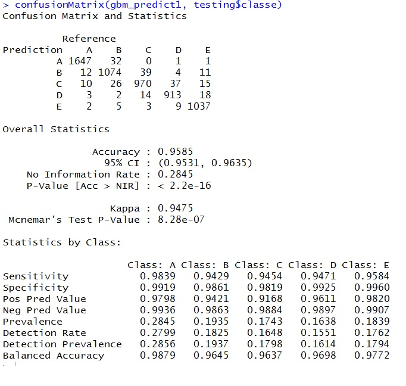

# R ML Assignment

## 1.0 Introduction
In the Practical Machine Learning assignment, we are given data measured from acceleromters from a pool of users as they performed barbell lifts in 5 ways (which ranges from one performed using good form , to those performed using bad form). Each way of performing a barbell lift was subsequently assigned a class label, resulting in five class labels of A<B, C, D, and E. In this assignment, a training set consiting of 19622 observations is provided, with each observation consisting of 160 predictor values. For the test set, 20 observations with feature length  of 160 is also provided. The goal of the assignment is to predict the class labels for each of the 20 observations. To begin the work of solving the assignment, we load the necessary libraries using the following code:
```{r message=FALSE, warning=FALSE}
library('caret')
library('randomForest')
library('e1071')
```


##2.0 Data acquisition
Data was provided through the two provided links at https://d396qusza40orc.cloudfront.net/predmachlearn/pml-training.csv and https://d396qusza40orc.cloudfront.net/predmachlearn/pml-testing.csv. This data is downloaded to the chosen R project folder and is read into the R environment using the following commands. We designate NA values in the dataset to include blanks, actual NAs and Nulls.
```{r message=FALSE, warning=FALSE}
training_org<-read.csv(file="C:\\Users\\peyter\\Documents\\R ML Assignment\\pml-training.csv",na.strings=c("", "NA", "NULL"))
testing_org<-read.csv(file="C:\\Users\\peyter\\Documents\\R ML Assignment\\pml-testing.csv",na.strings=c("", "NA", "NULL"))
```

##3.0 Preprocess data
The training and testing datasets were further preprocessed, with the following steps:

###3.1 Removal of predictor variables which contains too many NAs, as well as irrelevant predictor variables.
```{r message=FALSE, warning=FALSE}
#preprocess training_org by removing NA values
trainingNApp<- training_org[ , colSums(is.na(training_org)) == 0]
filter1 = c('X', 'user_name', 'raw_timestamp_part_1', 'raw_timestamp_part_2', 'cvtd_timestamp', 'new_window', 'num_window')
training_filter <- trainingNApp[, -which(names(trainingNApp) %in% filter1)]
#preprocess testing_org by removing NA values
testingNApp<- testing_org[ , colSums(is.na(testing_org)) == 0]
filter1 = c('X', 'user_name', 'raw_timestamp_part_1', 'raw_timestamp_part_2', 'cvtd_timestamp', 'new_window', 'num_window')
testing_filter <- testingNApp[, -which(names(testingNApp) %in% filter1)]
```

###3.2 Examine predictor variables for low variance
```{r message=FALSE, warning=FALSE}
#continue preprocess by removing near zero variance for training
zeroVar= nearZeroVar(training_filter[sapply(training_filter, is.numeric)], saveMetrics = TRUE)
training.nonzerovar = training_filter[,zeroVar[, 'nzv']==0]
#continue preprocess by removing near zero variance for testing
zeroVartest= nearZeroVar(testing_filter[sapply(testing_filter, is.numeric)], saveMetrics = TRUE)
testing.nonzerovar = testing_filter[,zeroVar[, 'nzv']==0]
```

###3.3 Remove highly correlated predictor variables
```{r message=FALSE, warning=FALSE}
#continue preprocess by removing highly correlated predictor variable for training
corrMatrix <- cor(na.omit(training.nonzerovar[sapply(training.nonzerovar, is.numeric)]))
removecor = findCorrelation(corrMatrix, cutoff = .90, verbose = TRUE)
training.decor = training.nonzerovar[,-removecor]
#continue preprocess by removing highly correlated predictor variable for testing
corrMatrixtest <- cor(na.omit(testing.nonzerovar[sapply(testing.nonzerovar, is.numeric)]))
removecortest = findCorrelation(corrMatrixtest, cutoff = .90, verbose = TRUE)
testing.decor = testing.nonzerovar[,-removecor]
```

Upon completion of the preprocessing process, the dimensionality of both the training and testing set has been reduced, with each set having 46 predictor variables.

##4.0 Cross validation

###4.1 Partitioning the pre-processed training set
As the training set provided for this assignment does not have the class label "classe", cross validation is performed by examining the in sample error. This process is started by partitioning the pre-processed training set into a sub-training and sub-testing set as shown in the code chunk below. Here, we chose a 70:30 split between the sub-training and sub-testing set.
```{r message=FALSE, warning=FALSE}
inTrain <- createDataPartition(y=training.decor$classe, p=0.7, list=FALSE)
training <- training.decor[inTrain,]
testing <- training.decor[-inTrain,]
```

###4.2 Classification using the GBM algorithm in the caret package
I chose the GBM algorithm, as I expected that it's performance will surpass that of a decision tree, and that of Random Forest ensemble, as GBM is a boosted algorithm. The main weakness of using GBM was the long training time to acquire a model, which slowed down the time for experiments. The code to create the GBM model using the sub-training set, and the prediction using the sub-testing set is shown below , without execution (rerunning the model each time the HTML code is rendered from markdown would be horribly time consuming!). The code to show the generation of the confusion matrix is shown as well.
```{r message=FALSE, warning=FALSE, eval=FALSE}
gbm_model1<-train(classe ~ ., method="gbm", data=training)
gbm_predict1 <- predict(gbm_model1,newdata=testing)
confusionMatrix(gbm_predict1, testing$classe)
```

The confusion matrix is shown below:



##5.0 Classifying the test set and printing the results to file
The GBM model gave reasonable performance, and it was then used to classify the test set for this assignment, using the following code:
```{r message=FALSE, warning=FALSE, eval=FALSE}
#test on actual data
gbm_predict2<-predict(gbm_model1, newdata=testing.decor)
#function to write labels
pml_write_files = function(x){
  n = length(x)
  for(i in 1:n){
    filename = paste0("problem_id_",i,".txt")
    write.table(x[i],file=filename,quote=FALSE,row.names=FALSE,col.names=FALSE)
  }
}
#write to files
pml_write_files(gbm_predict2)
```

##6.0 Conclusions
The key to completing this assignment was in choosing the best set of predictor variables, using variance and correlation as clues to eliminate unneeded columns. This approach was tidier than attempting to simulate missing values using knnImpute, as some predictor variables (columns) was simply too sparse for adequate replacement. 
Another thing to consider is the long training time necessary for models based on Random Forest (including GBM), and in future, perhaps running models in parallel might be the way to move forward.

